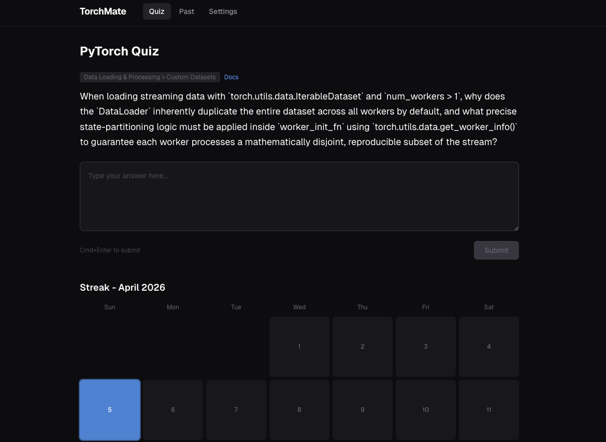

# TorchMate

A daily PyTorch quiz app that tests your knowledge of PyTorch internals, programming patterns, and best practices. Questions are generated by an LLM and grounded in official PyTorch documentation topics.



## Features

- **Daily quiz** — LLM-generated questions covering CUDA, autograd, distributed training, torch.compile, data loading, model architecture, and more
- **LLM evaluation** — submit your answer and get a detailed verdict with explanations referencing official PyTorch docs
- **Streak calendar** — GitHub-style monthly calendar that tracks your daily activity
- **Past questions** — full history of your Q&A submissions, newest first
- **Primary + fallback model** — if the primary model is rate-limited, the app automatically retries with a fallback model
- **Configurable** — choose any model available on [OpenRouter](https://openrouter.ai/models)

## Getting Started

### Prerequisites

- Node.js 18+
- An [OpenRouter](https://openrouter.ai) API key (free tier works)

### Setup

```bash
git clone https://github.com/chaerinkong/torchmate.git
cd torchmate
npm install
npm run dev
```

Open http://localhost:3000, go to **Settings**, and enter your OpenRouter API key. Then head back to **Quiz** to start.

### Configuration

All configuration is done through the Settings page in the app:

| Setting | Default | Description |
|---------|---------|-------------|
| API Key | — | Your OpenRouter API key |
| Primary Model | `qwen/qwen3.6-plus:free` | First model to try |
| Fallback Model | `nvidia/nemotron-3-super-120b-a12b:free` | Used if primary returns 429/5xx |

You can use any model available on OpenRouter. Free-tier models work out of the box.

## How It Works

1. On first load, the app generates 3 quiz questions and queues them (invisible to you)
2. You see one question at a time, tagged with a PyTorch topic and a link to the relevant docs
3. Type your answer and submit — the LLM evaluates it and provides a detailed explanation
4. The question flips to the next one only after you submit
5. Each submission marks the day on your streak calendar and logs the Q&A to the Past page
6. The queue auto-refills in the background after each submission

## Project Structure

```
src/
├── app/
│   ├── api/          # API routes (quiz, generate, config, past, streak)
│   ├── past/         # Past questions page
│   └── settings/     # Settings page
├── components/       # Quiz, StreakCalendar, Navigation
└── lib/
    ├── openrouter.ts    # OpenRouter client with fallback logic
    ├── pytorch-topics.ts # Curated topic bank with doc references
    └── storage.ts       # JSON file-based persistent storage
data/                 # Persistent storage (gitignored)
```

## Tech Stack

- [Next.js](https://nextjs.org) (App Router)
- [Tailwind CSS](https://tailwindcss.com)
- [OpenRouter](https://openrouter.ai) for LLM access

## License

MIT
